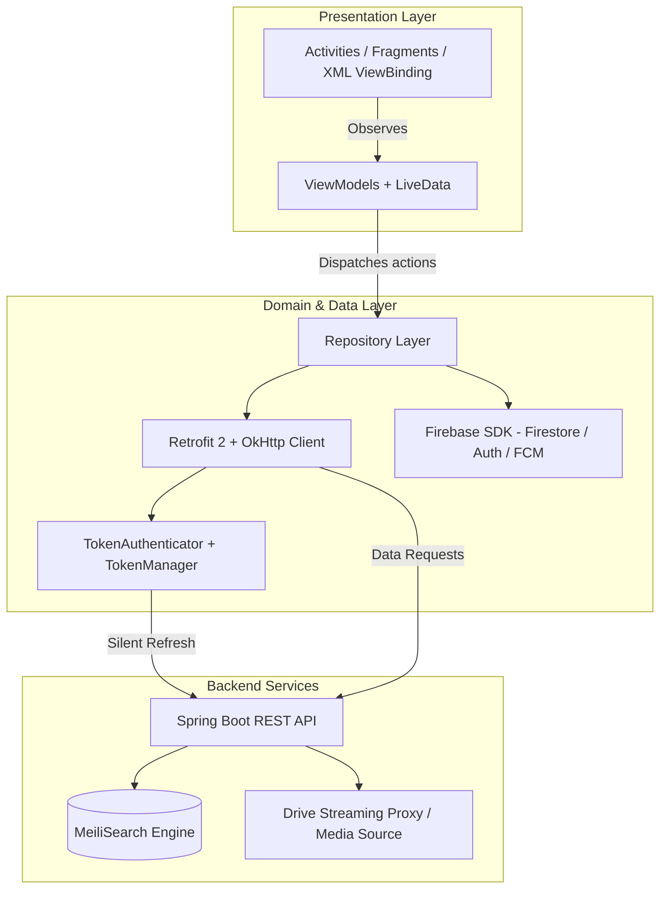

# AppXemPhim — Android Movie Streaming Client

[](https://developer.android.com/)
[](https://www.oracle.com/java/)
[]()
[](https://developer.android.com/media/media3)
[]()

A native Android movie streaming application built with **MVVM** and **Repository** patterns. Integrates **AndroidX Media3 ExoPlayer** for video playback with smart watch-progress resumption, **Retrofit 2 / OkHttp 3** with silent token refresh, and full-text search powered by the [App_xem_Phim_API](https://github.com/vucongchien/App_xem_Phim_API) (Spring Boot & MeiliSearch) backend.

---

## 🌟 Key Features

* **Authentication & Security**:
  * Email & Password authentication with OTP verification and password reset flows.
  * Google Sign-In via AndroidX Credential Manager and Firebase Auth.
  * Silent token refresh via custom OkHttp `TokenAuthenticator` with loop-guard prevention.
* **Movie Discovery**:
  * Home feed with trending titles, categorized carousels, and showtimes schedule.
  * Real-time search query resolution powered by MeiliSearch through REST API endpoints.
  * Filtering by genres, release year, and actor/director associations.
* **Streaming & Media Experience**:
  * Landscape-oriented, immersive video player built on **AndroidX Media3 ExoPlayer**.
  * Custom media controls, multi-episode playlist queue, and seek bars.
  * **Smart Resume Algorithm**: Automatically resumes playback when prior progress is within $5\% < \text{watch\_progress} < 95\%$.
* **Social & Interactions**:
  * Multi-level recursive discussion trees (`parent_comment_id` hierarchy).
  * Atomic comment upvoting/downvoting.
  * Movie review ratings, personal watch history tracking, and favorite bookmarks.
* **Push Notifications**:
  * Integrated Firebase Cloud Messaging (`MyFirebaseMessagingService`) for system updates and movie alerts.

---

## 🏗️ Architecture & Core Workflows

### System Architecture Overview



### 1. Silent Token Refresh Flow (`TokenAuthenticator`)
When an access token expires:
1. OkHttp receives an `HTTP 401 Unauthorized`.
2. `TokenAuthenticator` intercepts the failed request and calls `GET /auth/resettoken/{refreshToken}`.
3. If successful, `TokenManager` persists the new token and re-executes the original request with the new `Bearer` header.
4. If retry count $\ge 2$ or refresh fails, the request halts to prevent infinite loops.

### 2. Playback Resume Algorithm (`WatchVideoActivity`)
```text
Watch Progress (P) = (currentPosition / totalDuration) * 100

IF 5% < P < 95%:
    resumePosition = totalDuration * (P / 100)
    ExoPlayer.seekTo(resumePosition)
ELSE:
    Play from beginning (00:00)
```
Upon exiting playback, `onDestroy()` calculates the final percentage and persists it via `HistoryViewModel.addHistory()`.

---

## 🛠️ Tech Stack Matrix

| Category | Technology | Purpose |
| :--- | :--- | :--- |
| **Language & Platform** | Java 11, Android SDK 35 (Min SDK 26) | Core runtime environment |
| **UI Framework** | ViewBinding, DataBinding, Material Design 3 | Reactive view rendering & UI styling |
| **Architecture** | MVVM + Repository, AndroidX Lifecycle | Clean state separation & testability |
| **Media Player** | AndroidX Media3 ExoPlayer (`1.3.1`) | Video decoding, caching & custom UI controls |
| **Networking** | Retrofit 2 (`2.9.0`), OkHttp 3 (`4.12.0`) | REST API communication & custom interceptors |
| **Image Loading** | Glide (`4.16.0`), Picasso (`2.8`) | Remote poster & avatar caching |
| **Identity & Cloud** | Firebase Auth, Firestore, Realtime DB, FCM | Push notifications, comments, real-time sync |
| **Search Engine** | MeiliSearch (via Backend API) | Fast typo-tolerant full-text search |
| **Testing** | JUnit 4, Mockito, AndroidX Arch Core Testing | Unit testing & LiveData verification |

---

## 📁 Project Structure

```text
AppXemPhim/
├── app/
│   ├── src/
│   │   ├── main/
│   │   │   ├── java/com/example/appxemphim/
│   │   │   │   ├── LoginRegister/     # Auth Activities (Login, Register, OTP, ForgotPassword)
│   │   │   │   ├── Model/             # Domain POJOs & DTOs (Movie, Video, Comment, History)
│   │   │   │   ├── Network/           # Retrofit services, TokenAuthenticator, TokenManager
│   │   │   │   ├── Repository/        # Data abstraction layer (Movie, Auth, Comment, History)
│   │   │   │   ├── Request/           # API request payloads
│   │   │   │   ├── Response/          # API response wrappers
│   │   │   │   ├── Service/           # Firebase Messaging Service
│   │   │   │   ├── UI/
│   │   │   │   │   ├── Activity/      # MovieDetails, WatchVideo, Search, Home, Profile
│   │   │   │   │   ├── Adapter/       # RecyclerView adapters
│   │   │   │   │   ├── Fragment/      # HomeFragment, ProfileFragment, Filter Dialogs
│   │   │   │   │   └── Utils/         # CustomMedia3Controller, Resource state wrapper
│   │   │   │   └── ViewModel/         # Architecture ViewModels & Factories
│   │   │   └── res/                   # Layouts, drawables, navigation, animations
│   │   └── test/                      # Unit test suites and Test Catalog documentation
│   └── build.gradle.kts               # Module dependencies & compile configs
├── build.gradle.kts                   # Root build configuration
└── settings.gradle.kts                # Project module inclusions
```

---

## ⚙️ Getting Started & Configuration

### Prerequisites
* **Android Studio**: Ladybug (2024.2+) or later
* **JDK**: Version 17
* **Android SDK**: API Level 35 installed
* Running instance of the backend service: [App_xem_Phim_API](https://github.com/vucongchien/App_xem_Phim_API) (Spring Boot + MeiliSearch)

### 1. Configure Backend Endpoint
By default, the client points to a local network IP. Update the base URL to match your server or emulator environment:

* In `app/src/main/java/com/example/appxemphim/Network/RetrofitClient.java`:
  ```java
  // For Android Emulator targeting localhost on host machine:
  private static final String BASE_URL = "http://10.0.2.2:8081/";
  // Or your local LAN IP:
  // private static final String BASE_URL = "http://192.168.x.x:8081/";
  ```
* In `app/src/main/java/com/example/appxemphim/Network/RetrofitInstance.java`:
  ```java
  private static final String BASE_URL = "http://10.0.2.2:8081/";
  ```

### 2. Configure Firebase
Ensure your `google-services.json` file is placed in the `AppXemPhim/app/` directory.

### 3. Build and Run
Using Android Studio:
1. Open the `AppXemPhim` directory in Android Studio.
2. Allow Gradle sync to download required dependencies.
3. Select an emulator or physical device running Android 8.0 (API 26) or higher.
4. Click **Run** (`Shift + F10`).

Using Gradle CLI:
```bash
# Build debug APK
./gradlew assembleDebug

# Install directly to connected device
./gradlew installDebug
```

---

## 🧪 Testing & Quality Assurance

Unit test specifications, scenarios, and catalog are documented in [`app/src/test/README.md`](app/src/test/README.md).

Run all unit tests via command line:
```bash
# Execute local unit test suite
./gradlew testDebugUnitTest

# Run specific test class
./gradlew testDebugUnitTest --tests "com.example.appxemphim.TokenAuthenticatorTest"
```

---

## ⚖️ System Trade-offs & Notes

* **Hybrid Backend**: Uses Firestore for real-time nested comments and Spring Boot REST API for catalog and MeiliSearch integration. Provides rapid real-time updates while maintaining structured search indexing.
* **Video Source Proxy**: Streams video assets via an API proxy rather than HLS/DASH manifest streams. Simplifies direct playback on personal servers, though adaptive bitrate streaming can be added for high-traffic environments.
